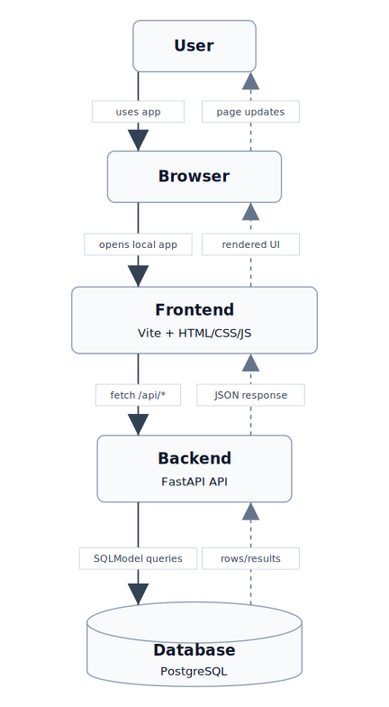
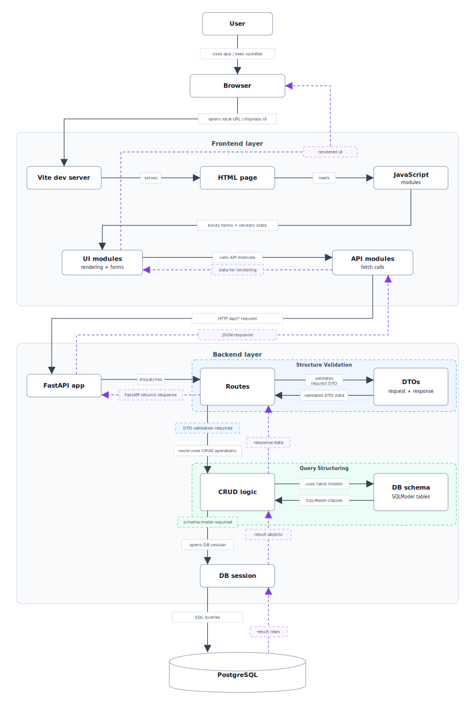
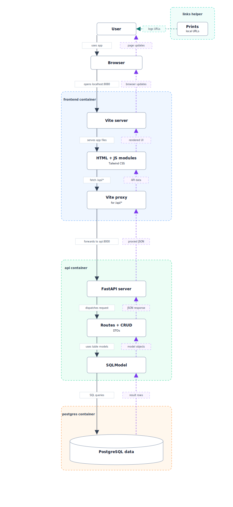

# Database Platform Reference

This repository contains a Dockerized reference application for a database course. It includes a PostgreSQL database, a FastAPI backend, and a Vite frontend that consumes the backend through browser `fetch` calls.

The demo domain is `Authors`, `Books`, `Categories`, and `Nationalities`.

## Contents

Use these links to navigate the repository guide:

- [What This Repository Contains](#what-this-repository-contains)
- [Database Model](#database-model)
- [Architecture Overview](#architecture-overview)
- [Tech Stack](#tech-stack)
- [Project Overview](#project-overview)
- [Backend Guide](backend/README.md)
- [Frontend Guide](frontend/README.md)
- [Quickstart](#quickstart)
- [Prerequisites](#prerequisites)
- [Environment Setup](#environment-setup)
- [How To Run](#how-to-run)
- [Useful URLs](#useful-urls)
- [Bootstrap Flow](#bootstrap-flow)
- [Resetting The Database](#resetting-the-database)
- [Troubleshooting](#troubleshooting)

## What This Repository Contains

This repository contains a complete local reference application with:

- A PostgreSQL database with Docker-managed persistence.
- A FastAPI backend that exposes JSON API endpoints.
- SQLModel table models, relationships, DTOs, and CRUD functions.
- Faker-based seed data for the demo domain.
- A Vite frontend that calls the API with browser `fetch`.
- Frontend modules for API calls, state, rendering, and form handling.
- SVG architecture diagrams that explain the application and container flow.
- Docker Compose configuration for running everything together locally.

## Database Model

The demo database uses four related relations: `nationality`, `author`, `category`, and `book`.

Relation notation:

```text
nationality(id, name)
category(id, name)
author(id, name, nationality_id)
book(id, title, publication_year, author_id, category_id)
```

Primary keys:

| Relation | Primary key |
| --- | --- |
| `nationality` | `id` |
| `category` | `id` |
| `author` | `id` |
| `book` | `id` |

Foreign keys:

| Relation | Foreign key | References |
| --- | --- | --- |
| `author` | `nationality_id` | `nationality.id` |
| `book` | `author_id` | `author.id` |
| `book` | `category_id` | `category.id` |

Relationship rules:

- One `nationality` can have many `author` records.
- One `author` can have many `book` records.
- One `category` can have many `book` records.

## Architecture Overview

High-level application flow: [View](docs/high-level-application-flow.svg)

<p align="center">
  <a href="docs/high-level-application-flow.svg">
    
  </a>
</p>

Detailed application flow: [View](docs/detailed-application-flow.svg)

<p align="center">
  <a href="docs/detailed-application-flow.svg">
    
  </a>
</p>

Docker container view: [View](docs/docker-container-view.svg)

<p align="center">
  <a href="docs/docker-container-view.svg">
    
  </a>
</p>

## Tech Stack

| Area | Technology |
| --- | --- |
| Containers | Docker Compose |
| Database | PostgreSQL |
| Backend | FastAPI |
| ORM / table mapping | SQLModel |
| Demo data | Faker |
| Frontend dev server | Vite |
| Frontend language | HTML, CSS, vanilla JavaScript |
| Styling | Tailwind CSS |

## Project Overview

The repository is split by responsibility: container orchestration at the root, backend API code under `backend/`, frontend browser code under `frontend/`, and diagram assets under `docs/`.

```text
db-platform-reference/
  backend/
    app/
      db/
      crud/
      routes/
      utils/
  frontend/
    src/
      api/
      state/
      ui/
  docs/
```

Root-level configuration defines how the services run together with Docker Compose, how local environment values are loaded, and how editor tooling resolves imports.

Backend directories:

| Directory | Responsibility |
| --- | --- |
| `backend/` | Backend container configuration and Python dependencies. |
| `backend/app/` | FastAPI application package and startup wiring. |
| `backend/app/db/` | Database connection settings, SQLModel table schema, and request/response DTOs. |
| `backend/app/routes/` | HTTP API endpoints grouped by domain concept. |
| `backend/app/crud/` | Database operations used by route handlers. |
| `backend/app/utils/` | Supporting backend helpers such as seed data and ID validation. |

See [`backend/README.md`](backend/README.md) for the backend-local data flow and directory guide.

Frontend directories:

| Directory | Responsibility |
| --- | --- |
| `frontend/` | Frontend container configuration, Vite setup, and package dependencies. |
| `frontend/src/` | Browser application source code loaded by Vite. |
| `frontend/src/api/` | `fetch` wrappers for backend API endpoints. |
| `frontend/src/state/` | Shared frontend state used while rendering the page. |
| `frontend/src/ui/` | DOM rendering, form handling, and browser interaction logic. |

See [`frontend/README.md`](frontend/README.md) for the frontend-local data flow and directory guide.

The `docs/` directory stores the SVG architecture diagrams used by this README.

## Quickstart

From the project root:

```sh
cp .env.example .env
docker compose up --build
```

Then open:

| Service | URL |
| --- | --- |
| Frontend | `http://localhost:8080` |
| API docs | `http://localhost:8000/docs` |

Stop the project with:

```sh
docker compose down
```

## Prerequisites

Install Docker Desktop or Docker Engine with the Docker Compose plugin.

No local Python, Node, npm, PostgreSQL, or Vite installation is required to run the reference application. Docker runs the required services inside containers.

## Environment Setup

This project ships `.env.example`, but each developer should create their own `.env` file.

Linux/macOS:

```sh
cp .env.example .env
```

Windows PowerShell:

```powershell
Copy-Item .env.example .env
```

The default values are for local classroom/demo use only. They are not production secrets.

Useful environment values:

| Variable | Meaning | Default |
| --- | --- | --- |
| `POSTGRES_DB` | Local database name | `library_demo` |
| `POSTGRES_USER` | Local database user | `library_user` |
| `POSTGRES_PASSWORD` | Local database password | `library_password` |
| `POSTGRES_HOST_PORT` | PostgreSQL port exposed on the host | `5433` |
| `API_PORT` | FastAPI port exposed on the host | `8000` |
| `FRONTEND_PORT` | Vite frontend port exposed on the host | `8080` |

Docker Compose overrides the backend container database host and port so the API connects to `postgres:5432` inside the Docker network.

## How To Run

From the project root:

```sh
docker compose up --build
```

Older Docker installations may use:

```sh
docker-compose up --build
```

Stop the running containers with:

```sh
docker compose down
```

## Useful URLs

With the default `.env` values:

| Service | URL |
| --- | --- |
| Frontend | `http://localhost:8080` |
| API root | `http://localhost:8000` |
| API docs | `http://localhost:8000/docs` |
| API docs through Vite proxy | `http://localhost:8080/docs` |
| Health check | `http://localhost:8000/health` |
| PostgreSQL from host tools | `localhost:5433` |

Docker Compose also prints these URLs through the `links` helper service.

## Bootstrap Flow

`docker compose up --build` performs the full local startup:

1. Reads `.env` values.
2. Builds the backend and frontend images if needed.
3. Starts PostgreSQL.
4. Waits until PostgreSQL is healthy.
5. Starts the FastAPI API container.
6. FastAPI creates missing tables with `SQLModel.metadata.create_all()`.
7. FastAPI inserts Faker demo data if the demo books table is empty.
8. Starts the Vite frontend container.
9. Vite serves the frontend and proxies `/api/*` requests to FastAPI.
10. The `links` helper service prints useful local URLs and exits.

## Resetting The Database

Normal startup keeps database data in a Docker volume. This is useful because data survives container restarts.

To delete the local database and start fresh:

```sh
docker compose down -v
docker compose up --build
```

Warning: `docker compose down -v` deletes Docker volumes for this project, including the PostgreSQL data volume.

## Troubleshooting

Missing `.env`:

Run `cp .env.example .env` or `Copy-Item .env.example .env` before starting Docker Compose.

Docker is not running:

Start Docker Desktop or the Docker service, then run `docker compose up --build` again.

Port already in use:

Change `API_PORT`, `FRONTEND_PORT`, or `POSTGRES_HOST_PORT` in `.env`.

Old seed data is still visible:

The database volume preserves data between restarts. Run `docker compose down -v` and then `docker compose up --build`.

Editor cannot resolve Python imports:

The project includes `pyrightconfig.json` for Pyright/BasedPyright editors. For better local autocomplete, create a Python virtual environment and install `backend/requirements.txt`.

Frontend cannot call the API:

Use the frontend URL `http://localhost:8080`. Vite proxies `/api/*` requests to the FastAPI container.
